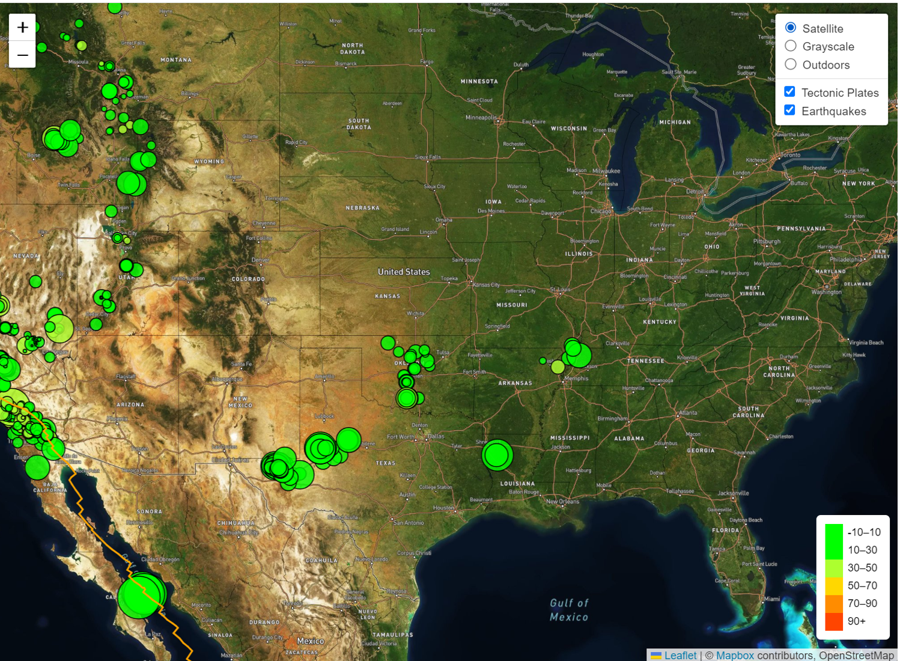

# Leaflet Challenge

## Project Description

The Leaflet Challenge involves creating a visualization tool to display earthquake data collected by the United States Geological Survey (USGS). The goal is to develop a meaningful and interactive way to visualize and educate the public and government organizations on the issues facing our planet.

- The challenge comprises two parts:
  - **Part 1: Earthquake Visualization**
  - **Part 2: Advanced Earthquake Visualization**
  
 

- ## Deployment and visualisation of the combined maps [leaflet-challenge](https://anyasorg.github.io/leaflet-challenge/)
  
## Table of Contents
- [Project Description](#project-description)
- [Project Structure](#project-structure)
- [Instructions](#instructions)
  - [Part 1: Create the Earthquake Visualization](#part-1-create-the-earthquake-visualization)
  - [Part 2: Gather and Plot More Data (Optional)](#part-2-gather-and-plot-more-data-optional)
- [Code Source](#code-source)
- [Setup and Execution](#setup-and-execution)
- [License](#license)
- [Author](#author)
- [Data Source and References](#data-source-and-references)

## Project Structure

- **Folders:**
  - leaflet_Part_1 - contains a static folder and index.html. The static folder contains CSS[style.css] and js [logic.js] folders.
  - leaflet_Part_2 - contains a static folder and index.html. The static folder contains CSS[style.css] and js [logic.js] folders.
  - images - contains:
    - 1_Data.png - screenshot of the USGS webpage at [earthquake.usgs.gov](https://earthquake.usgs.gov/earthquakes/feed/v1.0/geojson.php).
    - 2_JSON.png - screenshot of JSON dataset of "All Earthquakes from the Past 7 Days".
    - 3_JSON.png - screenshot of JSON dataset from the [tectonic plates dataset](https://github.com/fraxen/tectonicplates).
    - 4_BasicMap.png - Map screenshot of all the earthquakes from the JSON dataset of "All Earthquakes from the Past 7 Days" based on their longitude and latitude.
    - 5_Advanced.png - Map screenshot of the tectonic plates dataset and the earthquakes.
    - main_index.html - used for the combined deployment of the maps at [leaflet-challenge](https://anyasorg.github.io/leaflet-challenge/)

## Instructions

### Part 1: Create the Earthquake Visualization

1. **Get dataset:**
   - Visit the [USGS GeoJSON Feed](https://earthquake.usgs.gov/earthquakes/feed/v1.0/geojson.php) page.
   - Choose a dataset to visualize (e.g., "All Earthquakes from the Past 7 Days").
   - Obtain the JSON representation of the data.

2. **Import and visualize the data:**
   - Use Leaflet to create a map plotting all earthquakes based on longitude and latitude.
   - Size markers based on earthquake magnitude.
   - Color markers based on earthquake depth.
   - Include popups with additional earthquake information.
   - Create a legend for map data context.

### Part 2: Gather and Plot More Data (Optional)

1. **Plot a second dataset:**
   - Illustrate the relationship between tectonic plates and seismic activity.
   - Use the [tectonic plates dataset](https://github.com/fraxen/tectonicplates).
   - Use [tectonicplates/GeoJSON/PB2002_steps.json](https://github.com/fraxen/tectonicplates/blob/master/GeoJSON/PB2002_steps.json)

2. **Additional Tasks:**
   - Plot tectonic plates dataset alongside earthquakes.
   - Add other base maps to choose from.
   - Put each dataset into separate overlays for independent toggling.
   - Add layer controls to the map.

## Code Source
- The code for this project can be found at [GitHub Repository](https://github.com/AnyasorG/leaflet-challenge.git).

## Setup and Execution
- To set up and execute the project, follow these steps:
  1. Clone the repository to your local machine.
  2. Navigate to the respective folders for leaflet-Part-1 and leaflet-Part-2 to view directory structures.
  3. Open the main_index.html file in your preferred web browser (chrome) to view the visualizations.

## License
- This project is open-source and is made available under the terms of the MIT License ([MIT License](https://choosealicense.com/licenses/mit/)).

## Author
- [Godswill Anyasor](https://github.com/AnyasorG)
  
## Data Source and References
- Data is located at [GitHub Repository](https://github.com/AnyasorG/leaflet-challenge.git).
- Dataset created by the United States Geological Survey at [earthquake.usgs.gov](https://earthquake.usgs.gov/earthquakes/feed/v1.0/geojson.php).
- Tectonic JSON from Tectonicplates at [GitHub - fraxen/tectonicplates](https://github.com/fraxen/tectonicplates).
- Leafletjs Documentation (2024). Leafletjs Documentation at [leafletjs.com/reference.html](https://leafletjs.com/reference.html).
